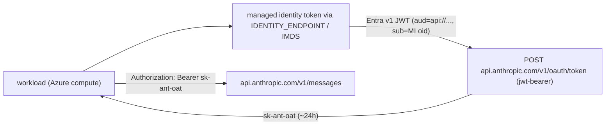

# Claude Workload Identity Federation (Azure Entra) — Setup Runbook

How to authenticate a workload to the Claude API using **Workload Identity Federation (WIF)** with an **Azure managed identity** instead of a static `ANTHROPIC_API_KEY`. The workload's Entra-issued JWT is exchanged for a short-lived Anthropic token (`sk-ant-oat...`) — no secrets to store or rotate.

> The single biggest gotcha is **token lifetime**: Entra managed-identity tokens live ~24h and cannot be shortened, and Anthropic's *issuer* has a separate max-lifetime cap that the setup wizard does not expose. See [Token lifetime — the critical part](#token-lifetime--the-critical-part).

> **Automation:** [`scripts/setup-anthropic-wif.sh`](../scripts/setup-anthropic-wif.sh) is a client-agnostic tool that performs the Azure side (managed identity + audience app registration), prints the Console wizard values, optionally raises the issuer max lifetime, and can deploy a small re-runnable Container Apps Job that mints+exchanges to verify the flow end to end. [`scripts/set-anthropic-issuer-lifetime.sh`](../scripts/set-anthropic-issuer-lifetime.sh) is a focused interactive helper for the issuer-lifetime update (Option C below).

Placeholders used throughout (replace with your values — see [Gather your values](#gather-your-values)):

`{TENANT_ID}`, `{MI_CLIENT_ID}`, `{MI_OBJECT_ID}`, `{AUDIENCE_APP_CLIENT_ID}`, `{FDIS_ID}`, `{ORG_ID}`, `{RULE_ID}`, `{SERVICE_ACCOUNT_ID}`, `{WORKSPACE_ID}`.

---

## TL;DR

1. The caller is the **workload's managed identity**, and it mints a **v1** Entra token (`iss = https://sts.windows.net/{TENANT_ID}/`).
2. Anthropic must trust: that **v1 issuer**, the **managed identity's object id** as `sub`, and the **audience** you request.
3. Azure managed-identity tokens are **~24h (about 86,700s)** and **cannot be shortened** — this is a hard Azure limitation.
4. Anthropic rejects them with `jwt_lifetime_too_long` until you raise the **issuer's** `max_jwt_lifetime_seconds` (default 3600) to comfortably above the token lifetime (e.g. `100800`). This is a *different field* from the rule's `token_lifetime_seconds`.
5. On **Azure Container Apps / App Service / Functions**, tokens come from `IDENTITY_ENDPOINT` (not the IMDS IP `169.254.169.254`).

---

## Architecture



Two distinct Azure objects are involved — do not confuse them:

| Role | What it is | How it's created |
| --- | --- | --- |
| **Caller / subject** | the managed identity the workload runs as; signs the JWT (`sub`/`oid`) | system- or user-assigned managed identity on your compute |
| **Audience** | an app registration that exists only to be the token's `aud` | a plain Entra app registration (no secret needed) |

The app-registration's *service principal object id* is **not** the caller. A managed-identity token's `sub` is always the **managed identity's** object id. Mixing these up is the most common mistake.

---

## Gather your values

| Placeholder | Meaning | How to obtain |
| --- | --- | --- |
| `{TENANT_ID}` | Entra Directory (tenant) id | `az account show --query tenantId -o tsv` |
| `{MI_CLIENT_ID}` | managed identity's client id (needed when user-assigned) | Portal → Managed Identities, or `az identity show -g <rg> -n <mi> --query clientId -o tsv` |
| `{MI_OBJECT_ID}` | managed identity's **object (principal) id** → the rule **subject** | `az identity show -g <rg> -n <mi> --query principalId -o tsv` |
| `{AUDIENCE_APP_CLIENT_ID}` | app registration used as the token audience | create/find an app registration; use its Application (client) ID |
| `{ORG_ID}` | Anthropic organization id | Claude Console (or the WIF wizard) |
| `{RULE_ID}` | federation rule id (`fdrl_…`) | created by the WIF wizard |
| `{SERVICE_ACCOUNT_ID}` | Anthropic service account id (`svac_…`) | created by the WIF wizard |
| `{WORKSPACE_ID}` | Anthropic workspace id (`wrkspc_…`) | Claude Console |
| `{FDIS_ID}` | federation issuer id (`fdis_…`) | created by the WIF wizard; list via the API below |

To confirm which managed identity a Container App runs as:

```bash
az containerapp show -n <app> -g <rg> --query "identity" -o json
# systemAssigned → identity.principalId; userAssigned → the entry's principalId + clientId
```

---

## Setup steps

### 1. Register the issuer + rule in the Claude Console

Settings → Workload Identity → Connect workload → **Microsoft Entra**. Provide:

- **Issuer**: use the **v1** issuer `https://sts.windows.net/{TENANT_ID}/` (trailing slash required). A managed identity **only ever emits v1 tokens** — do *not* use the v2 issuer `https://login.microsoftonline.com/{TENANT_ID}/v2.0`; a managed-identity token will never match it, and there is no supported way to make a managed identity emit v2 tokens.
- **Object (principal) ID** (rule subject): the **managed identity's object id** (`{MI_OBJECT_ID}`), NOT the app-registration service-principal object id. The wizard label is ambiguous — this trips people up.
- **Application (client) ID** (→ expected audience): the audience app-registration client id (`{AUDIENCE_APP_CLIENT_ID}`). The Console derives the expected audience from this; match the `resource` you request (see step 3) to the same form.
- Workspace, OAuth scope (usually `workspace:developer`), and the rule token lifetime (see caveat below).

### 2. Raise the issuer max token lifetime (REQUIRED — see next section)

The wizard creates the issuer with `max_jwt_lifetime_seconds = 3600` and does **not** expose the field. You must raise it above the managed-identity token lifetime. See [Updating the issuer max lifetime](#updating-the-issuer-max-lifetime).

### 3. Mint the token in the workload

**On Azure Container Apps / App Service / Functions**, use `IDENTITY_ENDPOINT` + `X-IDENTITY-HEADER` (the classic IMDS IP does not exist there). For a **user-assigned** identity you MUST pass `client_id`:

```
GET $IDENTITY_ENDPOINT?resource=api://{AUDIENCE_APP_CLIENT_ID}&api-version=2019-08-01&client_id={MI_CLIENT_ID}
Header: X-IDENTITY-HEADER: $IDENTITY_HEADER
```

**On a plain VM / VMSS** the classic IMDS endpoint applies instead:

```
GET http://169.254.169.254/metadata/identity/oauth2/token?resource=api://{AUDIENCE_APP_CLIENT_ID}&api-version=2018-02-01&client_id={MI_CLIENT_ID}
Header: Metadata: true
```

In code, `@azure/identity`'s `new ManagedIdentityCredential({ clientId }).getToken('api://{AUDIENCE_APP_CLIENT_ID}/.default')` handles the right endpoint automatically. (Omit `clientId` only for a system-assigned identity.)

### 4. Exchange for an Anthropic token

```bash
curl -sS https://api.anthropic.com/v1/oauth/token \
  -H "content-type: application/json" \
  -d '{
    "grant_type": "urn:ietf:params:oauth:grant-type:jwt-bearer",
    "assertion": "<the Entra JWT>",
    "federation_rule_id": "{RULE_ID}",
    "organization_id": "{ORG_ID}",
    "service_account_id": "{SERVICE_ACCOUNT_ID}",
    "workspace_id": "{WORKSPACE_ID}"
  }'
```

Success returns `{ "access_token": "sk-ant-oat...", "expires_in": ..., "scope": "workspace:developer", "token_type": "Bearer", ... }`. Send it as `Authorization: Bearer sk-ant-oat...` to `/v1/messages`.

---

## Token lifetime — the critical part

This is where most of the setup time goes. Three separate facts combine into one trap:

1. **Azure managed-identity tokens are ~24h (`exp - iat` around 86,700s) and CANNOT be shortened.** Microsoft explicitly does not support configurable token lifetimes for managed-identity service principals. There is **no Azure setting** for this — not on the identity, not on the compute, not via a token-lifetime policy. Don't waste time looking in Azure. (Under Continuous Access Evaluation the lifetime can even extend toward ~28h.)

2. **Anthropic validates the assertion's lifetime against the *issuer's* `max_jwt_lifetime_seconds`** (default **3600** = 1h; configurable **1–176,400s**, i.e. up to 49h). If `exp - iat` exceeds it → `jwt_lifetime_too_long`.

3. **There are TWO different "token lifetime" settings and it's easy to change the wrong one:**

   | Setting | Where | Range | What it controls |
   | --- | --- | --- | --- |
   | **`max_jwt_lifetime_seconds`** | on the **issuer** (`fdis_…`) | 1–176,400 | max allowed `iat→exp` of the **incoming Entra JWT**. ← the one that fixes `jwt_lifetime_too_long` |
   | **`token_lifetime_seconds`** | on the **rule** (`fdrl_…`) | 60–86,400 | lifetime of the **minted Anthropic token** Anthropic hands back |

   The Console wizard's "Token lifetime" dropdown is the **rule** one (caps at 24h) — changing it does **nothing** for the lifetime error. You must change the **issuer** field.

**Fix:** set the issuer's `max_jwt_lifetime_seconds` above your actual token lifetime. Decode a real token first and use `exp - iat` as the floor, then add headroom — e.g. **`100800` (28h)**. Note that a flat **24h (`86,400`)** is typically **a few hundred seconds too small** for managed-identity tokens (they run ~24h + a few minutes) — a common near-miss.

---

## Updating the issuer max lifetime

The wizard sets the issuer to the default `max_jwt_lifetime_seconds = 3600` and doesn't let you change it, so you must update the issuer after creation. Writing an issuer requires an **OAuth bearer or a Console session — Admin API keys are explicitly rejected** for this endpoint. Prefer the methods in order.

### Option A — Console UI (preferred)

Settings → Workload Identity → open the issuer → set the maximum token lifetime, and save. This is the intended, no-secrets path. (If the UI caps the value at 24h, use Option B — the API accepts up to 49h.)

### Option B — Documented API with an OAuth bearer

The supported programmatic path is `POST /v1/organizations/federation_issuers/{FDIS_ID}` with an **OAuth bearer token** (`sk-ant-oat…`) from an org **admin/owner**:

```bash
curl -sS -X POST "https://api.anthropic.com/v1/organizations/federation_issuers/{FDIS_ID}" \
  -H "anthropic-version: 2023-06-01" \
  -H "Authorization: Bearer $ANTHROPIC_OAUTH_TOKEN" \
  -H "content-type: application/json" \
  -d '{"max_jwt_lifetime_seconds":100800}'
```

Get an `$ANTHROPIC_OAUTH_TOKEN` by signing in as an org admin through an OAuth flow (e.g. the Claude Code / CLI login, or the Console's OAuth). Note: the `sk-ant-oat` minted by *this WIF setup itself* is scoped `workspace:developer` and generally cannot write issuers — you need an admin-scoped OAuth token.

### Option C — Console internal API (undocumented last resort)

Only if A and B aren't available. This is what to reach for when you're driving things remotely/programmatically and have neither UI access nor an OAuth bearer. It uses the **undocumented** endpoint the web app itself calls, authenticated by the Console **`sessionKey` cookie** — which is a full-access credential, so treat it accordingly. This may break without notice if Anthropic changes their internal API.

```bash
SK='sk-ant-sid02-...'         # Console session cookie (FULL-ACCESS SECRET — rotate after use)
ORG='{ORG_ID}'
H=(-H "Cookie: sessionKey=$SK; lastActiveOrg=$ORG" -H "anthropic-client-platform: web_claude_ai" -H "Origin: https://platform.claude.com" -H "content-type: application/json")

# List issuers → find the fdis_ id for your Entra v1 issuer
curl -sS "https://api.anthropic.com/api/console/organizations/$ORG/federation_issuers?include_archived=true" "${H[@]}"

# Update max lifetime (POST, not PATCH)
curl -sS -X POST "https://api.anthropic.com/api/console/organizations/$ORG/federation_issuers/{FDIS_ID}" \
  "${H[@]}" -d '{"max_jwt_lifetime_seconds":100800}'
```

Grab `sessionKey` from a logged-in Console tab (DevTools → Application/Storage → Cookies). The public `/v1/` endpoint does **not** accept this cookie — only the internal `/api/console/...` route does. Confirm the response echoes `"max_jwt_lifetime_seconds": 100800`, then sign out / rotate the session.

---

## Verifying end to end

Run the mint + exchange **inside the Azure workload** (the managed identity only exists there). `az containerapp exec` needs a TTY, so drive it via a PTY if scripting it. Decode the Entra JWT and confirm:

- `iss` = `https://sts.windows.net/{TENANT_ID}/` (v1)
- `aud` = `api://{AUDIENCE_APP_CLIENT_ID}` (matches the rule's expected audience)
- `sub` = `{MI_OBJECT_ID}` (the managed identity object id)
- `exp - iat` ≈ the managed-identity lifetime (~86,700s)

Then POST to `/v1/oauth/token`. A `200` with an `access_token` means it's wired correctly.

The public exchange API always returns a **generic** `401 authentication_error` on failure. The **specific** reason (e.g. `jwt_lifetime_too_long`, issuer/subject/audience mismatch) is only visible in **Console → Settings → Workload Identity → Authentication events**. Always check there first when debugging.

---

## Troubleshooting

| Symptom | Cause | Fix |
| --- | --- | --- |
| `curl` to `169.254.169.254` hangs/times out | Not on Azure compute, or on Container Apps/App Service (no classic IMDS) | Use `$IDENTITY_ENDPOINT` + `X-IDENTITY-HEADER`; only works inside the workload |
| Empty `$JWT` | metadata endpoint unreachable (e.g. running on a laptop) | Run inside the Azure compute with the identity assigned |
| `401 authentication_error` (generic) | Any validation failure | Check **Authentication events** for the real reason |
| Auth event: issuer mismatch / `invalid_grant` | Rule uses v2 issuer or wrong trailing slash | Set issuer to `https://sts.windows.net/{TENANT_ID}/` (v1, trailing slash) |
| Auth event: subject mismatch | Rule subject set to app-reg SP object id | Set subject to the **managed identity** object id (`{MI_OBJECT_ID}`) |
| Auth event: audience mismatch | `resource` form ≠ rule's expected audience | Keep both `api://{AUDIENCE_APP_CLIENT_ID}` (or both the bare GUID) |
| Auth event: `jwt_lifetime_too_long` | Issuer `max_jwt_lifetime_seconds` below the token lifetime | Raise the **issuer** `max_jwt_lifetime_seconds` (not the rule dropdown) above `exp - iat` |
| `AADSTS65001` from `az account get-access-token` locally | CLI first-party app not consented for the resource | Irrelevant to prod; the workload uses its managed identity, not your user |

---

## Notes

- Re-running the wizard can create **duplicate issuers**; keep one and remove extras to avoid confusion. List them via the API in [Option B](#option-b--console-internal-api).
- Agent Skills (pptx/docx/xlsx/pdf) and the Files API work **only** on this direct WIF path (`api.anthropic.com`), not when routing Anthropic models through Azure AI Foundry. Skill-generated files come back as a `file_id` to download via the Files API and persist into your own storage.
- The minted `sk-ant-oat` token's real lifetime is `min(rule token_lifetime_seconds, 2 × remaining Entra-JWT lifetime)`, floored at 60s — cache it and refresh before `expires_in`.
